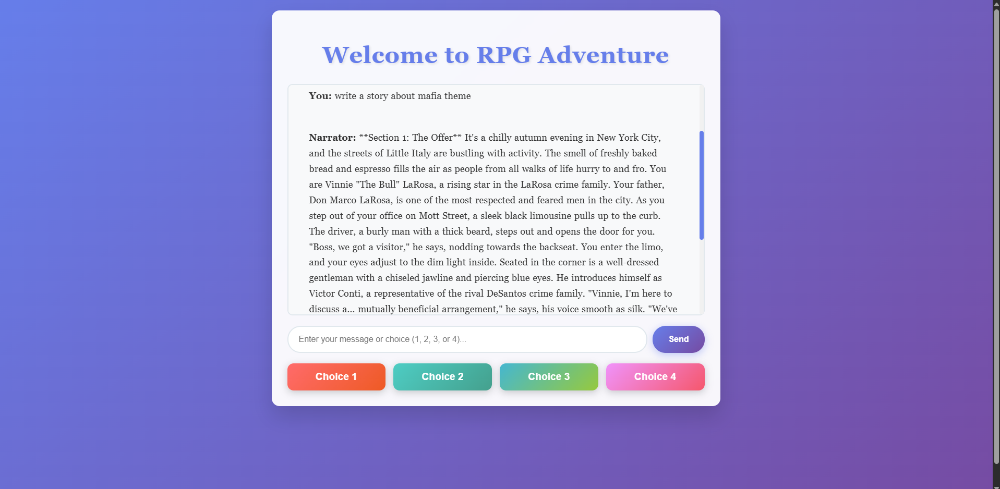
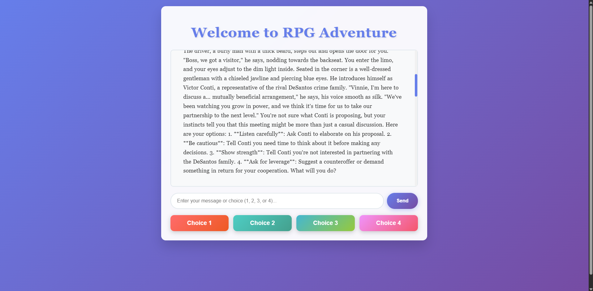

# LLaMA RPG Narrator

An interactive text-based Role Playing Game (RPG) powered by LLaMA 3.1 AI model, featuring dynamic storytelling with branching narratives based on player choices.


*The game interface showing the initial story setup with a mafia theme*


*Story progression with the four choice options clearly displayed*

## Overview

This project creates an immersive RPG experience where an AI narrator (powered by LLaMA 3.1) guides players through dynamic, branching storylines. Players make choices at critical story junctions, with each decision shaping the narrative's direction. The system maintains conversation memory to ensure story continuity and character consistency throughout the adventure.

## Key Features

- **AI-Driven Storytelling**: LLaMA 3.1 generates unique, contextual narratives based on player choices
- **Interactive Choice System**: Four distinct options at the end of each story section
- **Conversation Memory**: Retains the last 30 interactions for story continuity
- **Modern Web Interface**: Responsive design with gradient colors and smooth animations
- **Real-time Responses**: Flask API provides instant story generation
- **Flexible Themes**: Support for any story genre (fantasy, sci-fi, mystery, mafia, etc.)

## Project Structure

```
llama-rpg-narrator/
│
├── screenshots/
│   ├── Screenshot_1.png
│   └── Screenshot_2.png
├── static/
│   └── index.html
├── Receiver.py
└── README.md
```

## Installation & Setup

### Prerequisites

- Python 3.8 or higher
- Ollama installed on your system
- Modern web browser (Chrome, Firefox, Safari, Edge)
- At least 8GB RAM (16GB recommended for better performance)

**Python packages required:**
- flask
- ollama

### Step 1: Clone the Repository

```bash
git clone https://github.com/naholav/llama-rpg-narrator.git
cd llama-rpg-narrator
```

### Step 2: Install Python Dependencies

```bash
pip install flask ollama
```

### Step 3: Install and Setup Ollama

1. **Download and Install Ollama** from [https://ollama.com/download](https://ollama.com/download)
   - Choose your operating system (Windows, macOS, or Linux)
   - Download and run the installer
   - Follow the installation instructions

2. **Download and Setup the LLaMA 3.1 model**:
```bash
ollama run llama3.1
```

This single command will:
- Automatically start the Ollama service if not running
- Download the LLaMA 3.1 model (about 4.7GB)
- Run the model in interactive mode

**Note:** The download happens only once. Progress will be shown:
```
pulling manifest 
pulling 8eeb52dfb3bb... 100% ████████████████ 4.7 GB                         
verifying sha256 digest 
writing manifest 
success
```

After download completes, you'll see:
```
>>> Send a message (/? for help)
```

You can exit with `/bye` or `Ctrl+D`. The model is now ready for use with your game.

### Step 4: Run the Game

1. **Start the Flask server**:
```bash
python Receiver.py
```

2. **Open your browser** and go to:
```
http://localhost:5000
```
or
```
http://127.0.0.1:5000
```

**Note**: You'll see this output when the server starts successfully:
```
* Serving Flask app 'Receiver'
* Debug mode: on
* Running on http://127.0.0.1:5000
Press CTRL+C to quit
```

## How to Play

### Starting a New Game

1. **Launch the game** in your browser
2. **Set the theme** by typing your initial message:
   - "write a story about mafia theme"
   - "create a fantasy adventure"
   - "start a sci-fi mystery"
   - "begin a medieval quest"
3. **Wait for the narrator** to begin your adventure

**Note**: If you send an unclear message (like "asd"), the narrator will ask for clarification:
```
You: asd
Narrator: It seems like you'd like to start our RPG game, but I didn't receive 
a response from you regarding the topic and details of the game...
```

### Making Choices

You have two ways to interact:

1. **Quick Choice Buttons**: Click one of the four colored buttons (Choice 1-4)
2. **Text Input**: Type your choice number (1, 2, 3, or 4) or custom responses

### Game Flow

```
Player Input → AI Processes → Story Generation → Present Choices → Repeat
```

The AI narrator will:
- Create detailed story sections
- Maintain character consistency
- Remember previous choices
- Provide four meaningful options at each decision point

## API Documentation

### Core Endpoints

#### `POST /api/response`
Processes player input and generates AI story response.

**Request:**
```json
{
  "prompt": "1"
}
```

**Response:**
```json
{
  "response": "Narrator's story continuation...",
  "status": "success"
}
```

#### `GET /api/memory/status`
Check the current conversation memory status.

**Response:**
```json
{
  "conversations_stored": 15,
  "max_conversations": 30,
  "total_messages": 30,
  "status": "success"
}
```

#### `POST /api/memory/clear`
Reset the conversation history for a fresh start.

#### `GET /api/memory/export`
Export the entire game session for later reference.

## Configuration

### Customizing the Narrator

Edit the `context` variable in `Receiver.py`:

```python
context = "We will play a RPG(role play game).In this game will be sections..." 
```

### Adjusting Memory Limits

```python
MEMORY_LIMIT = 30  # Increase for longer story retention
conversation_memory = deque(maxlen=60)  # Adjust accordingly
```

### Modifying UI Theme

The interface uses gradient backgrounds and modern styling. Edit colors in `index.html`:

```css
background: linear-gradient(135deg, #667eea 0%, #764ba2 100%);
```

## Features Explained

### Memory System
- Stores last 30 user-AI interaction pairs
- Maintains story continuity across sessions
- Prevents repetition and ensures character consistency

### Choice System
- Four distinct options per story section
- Each choice leads to different narrative branches
- Invalid choices trigger helpful warnings

### Story Generation
- Context-aware narrative creation
- Dynamic character development
- Consistent world-building

## Troubleshooting

### Common Issues

**"Connection to Ollama failed"**
- Ensure Ollama is installed and running
- Check if LLaMA 3.1 is installed: `ollama list`
- Try running `ollama run llama3.1` in a separate terminal

**"Port 5000 is already in use"**
- Change the port in `Receiver.py`:
```python
app.run(debug=True, port=5001)
```

**"Slow response times"**
- LLaMA 3.1 requires significant resources
- Consider using a smaller model: `ollama run llama2:7b`
- Ensure adequate RAM (8GB+ recommended)

**"Story doesn't remember previous choices"**
- Check memory status endpoint
- Verify conversation_memory is not cleared accidentally

## Contributing

We welcome contributions! Here's how:

1. Fork the repository
2. Create a feature branch: `git checkout -b feature/AmazingFeature`
3. Commit changes: `git commit -m 'Add AmazingFeature'`
4. Push to branch: `git push origin feature/AmazingFeature`
5. Open a Pull Request

### Development Guidelines

- Follow PEP 8 for Python code
- Comment complex logic
- Test thoroughly before submitting
- Update documentation as needed

## License

This project is licensed under the MIT License - see the [LICENSE](LICENSE) file for details.

## Acknowledgments

- [Ollama](https://ollama.ai) - Making LLM deployment simple
- [Meta AI](https://ai.meta.com/) - For the LLaMA model
- [Flask](https://flask.palletsprojects.com/) - Lightweight web framework
- The open-source community for inspiration

## Support

- **Issues**: Open an issue on GitHub
- **Discussions**: Start a discussion for feature requests

---

**Note**: This is an educational project. For commercial use, please review the LLaMA model license terms.
